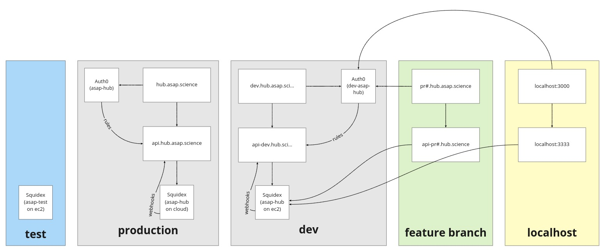

# CI/CD Pipeline

## GitLab CI Variables

| NAME                    | feature\*                        | production                   | default                          |
| ----------------------- | -------------------------------- | ---------------------------- | -------------------------------- |
| ASAP_API_URL            | https://#mr-api.hub.asap.science | https://api.hub.asap.science | https://dev-api.hub.asap.science |
| ASAP_APP_URL            | https://#mr.hub.asap.science     | https://hub.asap.science     | https://dev.hub.asap.science     |
| AUTH0_CLIENT_ID         |                                  | \*                           | \*                               |
| AUTH0_DOMAIN            |                                  | dev-asap-hub.us.auth0.com    | asap-hub.us.auth0.com            |
| AUTH0_SHARED_SECRET     |                                  | \*                           | \*                               |
| AWS_ACCESS_KEY_ID       |                                  |                              | \*                               |
| AWS_ACM_CERTIFICATE_ARN |                                  |                              | \*                               |
| AWS_DEFAULT_REGION      |                                  |                              | us-east-1                        |
| AWS_REGION              |                                  |                              | us-east-1                        |
| AWS_SECRET_ACCESS_KEY   |                                  |                              | \*                               |
| CODECOV_TOKEN           |                                  |                              | \*                               |
| GLOBAL_TOKEN            |                                  |                              | \*                               |
| SQUIDEX_BASE_URL        |                                  | https://cloud.squidex.io     | \*                               |
| SQUIDEX_APP_NAME        |                                  | \*                           | \*                               |
| SQUIDEX_CLIENT_ID       |                                  | \*                           | \*                               |
| SQUIDEX_CLIENT_SECRET   |                                  | \*                           | \*                               |

\* Variables set by `ci/env-setup.sh` script.

## Environments

## Docker Images

The docker images are built using a GitHub Action workflow - build-images.yml.

These are currently set to build only on master, and the images used in the
GitLab pipeline are fixed. See .gitlab-ci.integration.yml.

To build new images:

- Update build-images.yml to build from the current branch and not master.
- Update the Dockerfile and push the changes.
- Change .gitlab-ci.integration.yml to use the latest or the commit SHA tag for
  the image. (Alternatively tag the image with the branch name)

  `INTEGRATION_DOCKER_IMAGE: $ECR_REGISTRY/$ECR_PROJECT/node-python-sq:latest`
  or
  `INTEGRATION_DOCKER_IMAGE: $ECR_REGISTRY/$ECR_PROJECT/node-python-sq:24fd3be959653a9b5ff966e104e74396bcb0e8c1`
  or
  `INTEGRATION_DOCKER_IMAGE: $ECR_REGISTRY/$ECR_PROJECT/node-python-sq:my-branch-name`

- Once finished, change the build-images.yml back to master and update
  .gitlab-ci.integration.yml to point to the image. This is constructed from the
  commit SHA plus the image checksum. To git the image checksum view the DIGEST
  column in the ECR repository.

  `INTEGRATION_DOCKER_IMAGE: $ECR_REGISTRY/$ECR_PROJECT/node-python-sq:24fd3be959653a9b5ff966e104e74396bcb0e8c1@sha256:5426a5b0f9eceb566f14a1e916979648cf4c80087a77dc34f020d346125bca76`
