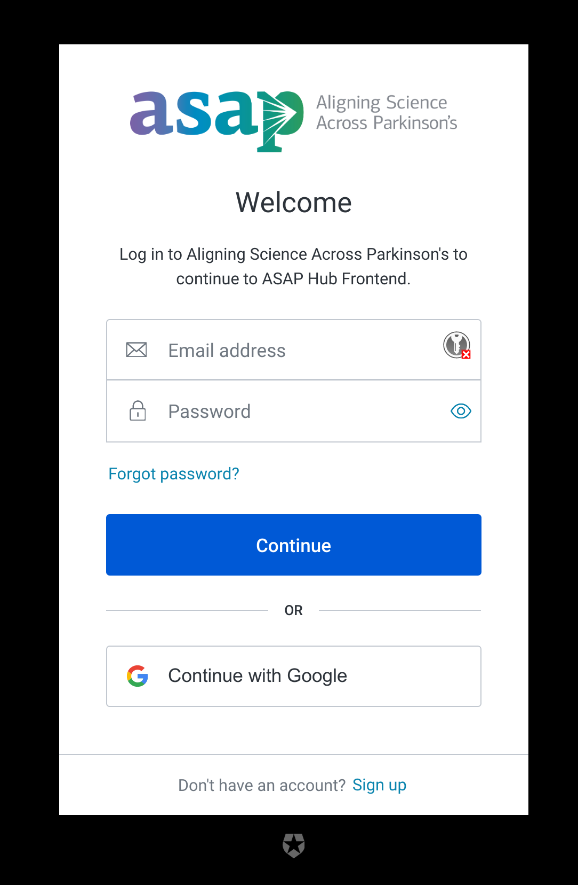
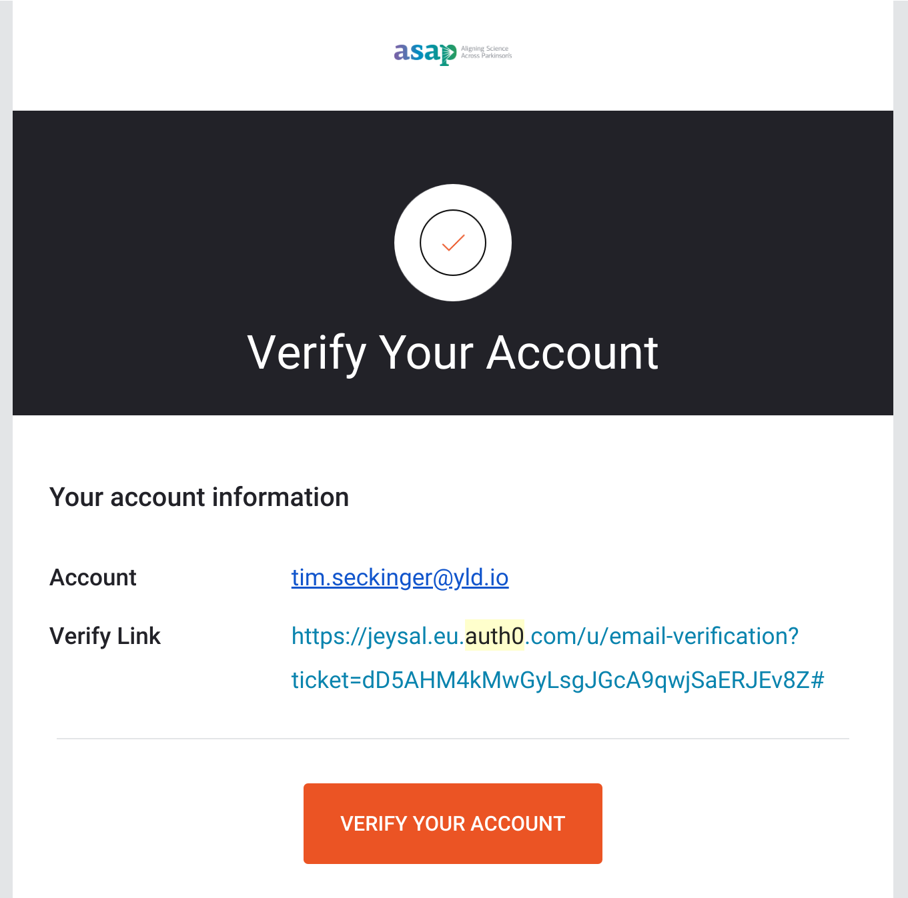

# Auth0

Status: Final

Date: 2020-05-05

Author: Tim Seckinger <tim.seckinger@yld.io>

## Context

Auth0 is a cloud-based off-the-shelf solution to manage identity (authentication and authorisation). With this spike, we intend to validate how an Auth0 integration may work for us.  
https://trello.com/c/akzjqnQ4/16-identity-management-solution-auth0

## Questions

### Should we use universal or embedded login?

Universal login is a strategy where the user is redirected to the authentication service (such as Auth0) to log in, out, or register, and then sent back to the main site with authentication information attached. On good internet connections, this process is nowadays fairly seamless. Due to the increasing prevalence of Single sign-on (SSO) by providers such as Google, users are now also used to this kind of redirect process for authentication.  
Embedded login is a strategy where the user logs in, out, and registers on the main site itself, for example on a dedicated page, in a section of a page, or in a pop-up. In an SSO scenario, a redirect to the authentication provider (such as Google) is still required.  
Auth0 compares universal and embedded login on [this page](https://auth0.com/docs/guides/login/universal-vs-embedded). We have identified that most importantly, universal login has the following beneficial properties for us:

1. Universal login is easier for us to implement. We can use modern libraries such as `auth0-spa-js` that are built only or primarily for universal login, as it is widely considered the more modern strategy.
1. Universal login is more secure, as it does not use cross-origin requests between the main site and the authentication service and is thus not susceptible to cross-origin-related attack vectors.
1. Offering a universal login page on our authentication service also opens up the possibility for future ASAP apps to implement authentication using the same service very easily in the future, or for us to easily become an authentication provider for third party tools if every required.

As long as there are no grave concerns due to very specific UX requirements, we highly recommend using universal login.

### How can we brand the authentication view and verification email?

We can use our application's name and logo on the authentication view and we can customize it's primary/button and background colors.
For example, the view can look like this:

Full HTML customization is also available and seems to not require a paid tier, but this is not confirmed with certainty.

We can use our application's name and logo in the verification email.
For example, the email can look like this:

Full HTML customization is only available on the paid developer tier and above.

For more information about free and paid tiers, refer to the question further down.

### How much dev time do we expect to save by using Auth0?

We can only make an educated guess as to how much time using Auth0 would save as opposed to using a Free and Open-Source Software (FOSS) solution such as Keycloak for authentication. There is a lot of uncertainty and risk involved if we have to implement large parts of authentication ourselves, even using a FOSS solution.

1. Setting up a server and the configuration around login/register forms and verification emails, even without further security features such as Multi-factor authentication (MFA), may take 3 days using Keycloak as opposed to 1 day for configuring Auth0 (e.g. regarding user permissions, scopes, and claims) without server setup involved.
1. Integrating the Keycloak server into the project infrastructure and deploying it securely may take 3 days. Using Auth0 involved no similar task (0 days).
1. Implementing the handling of user tokens in the frontend, including somewhat delicate matters like refreshing, may take 10 days using a custom solution, as opposed to about 3 days using Auth0's standard libraries.

The initial savings form using Auth0 are likely to be at least 10-15 days.
Future features like becoming an identity provider ourselves, and user management tools, could also take around 1x to 2x the time if we do not use Auth0.

### What are the alternatives?

[Okta](https://okta.com) is a service similar to Auth0. Based on reputation in our developer circles, we would recommend using Auth0 over using Okta.  
[Amazon Cognito](https://aws.amazon.com/cognito/) is a service similar to Auth0. Based on reputation in our developer circles, we would recommend using Auth0 over using Amazon Cognito, unless already heavily locked into the Amazon ecosystem.  
[Keycloak](https://www.keycloak.org/) is a Free and Open-Source Software (FOSS) solution to manage identity, with similar features to Auth0. Unlike a cloud-based provider, we would host a Keycloak instance ourselves. We consider this to be the alternative worth considering the most and compare it to using Auth0 in some other sections of this document.  
[Gluu](https://www.gluu.org/) is a commercial identity management solution that is not cloud-based, but instead intended to be deployed on your own. Auth0 only offers this option on their highest plan. Gluu's approach could be considered in between Keycloak and Auth0 for our purposes.

### Which features or usage numbers will require us to upgrade to a paid version?

Auth0 explains their free plan and their three paid tiers on [this page](https://auth0.com/pricing/). Higher plans include additional features. Plans are also distinguished by (often variable) active users (users who have used the application at least once during the last 30 days).

1. The free plan costs 0 USD/yr for 7000 active users
1. The Developer tier starts at 253 USD/yr for 1000 active users.
1. The Developer pro tier starts at 308 USD/yr for 100 active users.
1. The Enterprise tier is offered by their Sales team on a case basis.

We have identified the following requirements as most likely to cause the need for us to upgrade to a paid tier:

1. More than 2 (e.g. Google and ORCID) identity providers - Developer tier
1. Full email customization - Developer tier
1. Using our own domain name (instead of something like asap.eu.auth0.com) for the authentication views - Developer tier
1. Auth0's Roles and Group management [beyond the basics](https://community.auth0.com/t/do-you-need-to-use-the-authorization-extension-with-the-core-authorization-library/23158) - Developer Tier
1. More than 7000 users (unlikely for a long time) - Developer Tier up to 50000

However, it seems that none of these are urgent matters, so we can likely start off with the free plan for quite some time.

### Would the devs recommend using Auth0, or do we consider it likely not to be worth it?

Even though as developers we value Free and Open-Source (FOSS) solutions and would be interested in getting Keycloak to work for our purposes, given the limited time we have for building the MVP, we believe that it is better not to take the risk of investing a mostly unknown amount of time into building a custom solution. We recommend using Auth0 for at least the first iterations of the product.
